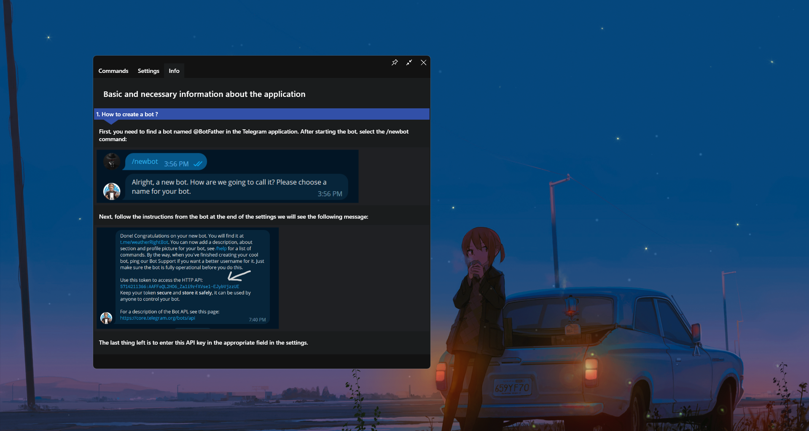
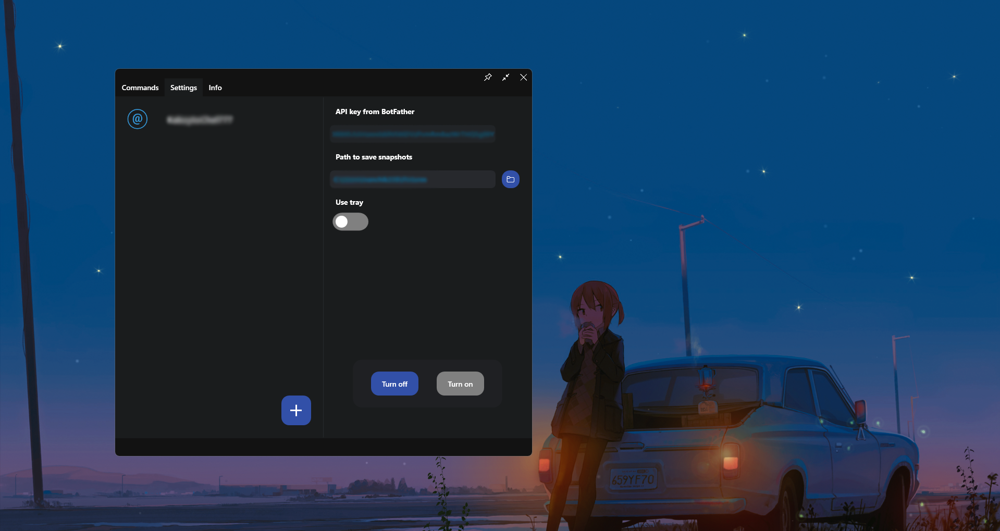
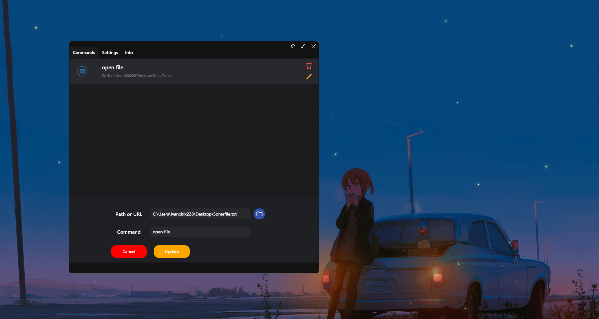
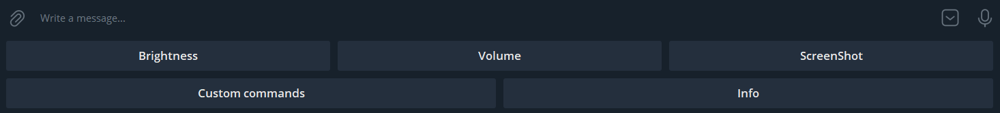

# "Telegram remote control - TRC" project description 

**"Telegram remote control - TRC"** - is a pet-project application designed for remote control of some computer functions via a bot in Telegram messenger, developed using **WPF .NET Core**. The main functions include:
- Changing the brightness of the computer monitor,
- Changing the overall volume of the system,
- Taking a screenshot in real time,
- Calling "Custom command", otherwise opening applications or files by triggering a user command,
- Among others there is a **Whitelist**, for Telegram users who can connect and control the computer.

## How to use the app:
After opening the app, in the top left corner you can see 3 tabs
- Commands,
- Settings,
- Info.

If you go to the ***"Info"*** section, you will see instructions on how to create a Telegram bot and use it to interact with the app.
The key element is the **API key**, which is specified in the settings section in the ***"API key from BotFather"*** field.

Also in the settings you should specify the path for saving screenshots, by default it will be the **system Pictures folder of the current user of the system**.

Do not forget about the **Whitelist**, to add a new user there you should click on the button with a cross in the bottom right corner of the list, and enter the nickname of the user Telegram that goes through **'@'**, this symbol itself does not need to be entered. 

After adding a user with this nickname will be able to control the target computer through the bot, the API key of which is specified at startup in the settings.
To activate the bot, you need to click on the ***"Turn on"*** button in the ***"Settings"*** section.

## "Custom commands":

The mechanism for using such commands provides the ability to launch an application or open a file on your computer using its path. 
To create a new trigger per command:

 Go to ***"Commands"*** -> **click on the cross button in the lower right corner** -> **in the panel that appears, select the file path and enter which command the trigger will be triggered by**. 
To execute, send this command to a bot that is synchronised with your computer via the app.

## Quick Access Toolbar:
The panel opens in the dialogue with the bot itself, it has 5 buttons on it:
- Brightness control - ***"Brightness"***
- Volume control - ***"Volume"***
- Take a screenshot - ***"Screenshot"***
- List of triggers - ***"Custom commands"***
- Instructions - ***"Info"***

## Brightness and volume controls:
To control the brightness or volume settings, you must select the appropriate function from the **"Quick Access Toolbar"**.
In the dialogue with the bot, a panel with buttons will appear where you can adjust the levels and also find out the current brightness/volume level.

## Screenshot:
To take a screenshot on the **"Quick Access Toolbar"** you need to select ***"ScreenShot"***, the taken screenshot will be sent to the dialogue with the bot and also saved to the path set in the ***"Settings"*** -> ***"Path to save snapshots"***.

### Conclusion:
To summarise all the above, this pet-project is a start-up implementation of a project for remote computer control with an intuitive graphical interface. The purpose of this pet-project was to demonstrate it in a college.