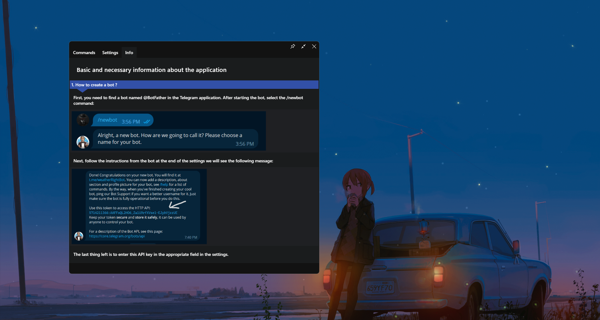
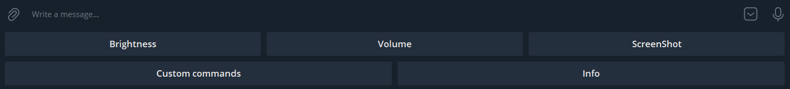

# Опис проекту "Telegram Remote Control - TRC" 

## Мови
- [English](./README.md)
- [Русский](./README_RU.md)
- [Українська](./README_UA.md)

**"Telegram remote control - TRC "** - проектний додаток, призначений для дистанційного керування деякими функціями комп'ютера через бота в месенджері Telegram, розроблений з використанням **WPF .NET Core**. До основних функцій відносяться
- Зміна яскравості монітора комп'ютера,
- Зміна загальної гучності системи,
- Зробити знімок екрану в реальному часі,
- Виклик "Користувацької команди", тобто відкриття додатків або файлів за командою користувача,
- Серед іншого є **Білий список**, для користувачів Telegram, які можуть підключатися та керувати комп'ютером.

## Як користуватися додатком:
Після відкриття програми, у верхньому лівому кутку ви побачите 3 вкладки
- Команди,
- Налаштування,
- Інформація.

Якщо ви перейдете в розділ ***"Інфо "***, то побачите інструкцію про те, як створити Telegram-бота і використовувати його для взаємодії з додатком.
Ключовим елементом є **API-ключ**, який вказується в розділі налаштувань у полі ***"API-ключ від BotFather "***.

Також у налаштуваннях слід вказати шлях для збереження скріншотів, за замовчуванням це буде папка **system Pictures поточного користувача системи**.

Не забуваємо про **White list**, для додавання туди нового користувача слід натиснути на кнопку з хрестиком в правому нижньому кутку списку, і ввести нік користувача Telegram, який проходить через **'@'**, сам цей символ вводити не потрібно. 

Після додавання користувач з таким ніком зможе керувати цільовим комп'ютером через бота, API-ключ якого вказується при запуску в налаштуваннях.
Для активації бота потрібно натиснути на кнопку ***"Увімкнути "*** в розділі ***"Налаштування "***.

## "Користувацькі команди":

Механізм використання таких команд надає можливість запустити програму або відкрити файл на комп'ютері за її шляхом. 
Щоб створити новий тригер на команду:

 Перейдіть в ***"Команди "*** -> **натисніть на кнопку з хрестиком у правому нижньому кутку** -> **в панелі, що з'явилася, виберіть шлях до файлу і введіть, за якою командою буде спрацьовувати тригер**. 
Для виконання надішліть цю команду боту, який синхронізується з вашим комп'ютером через додаток.

## Панель швидкого доступу:
Панель відкривається в діалозі з самим ботом, на ній розташовано 5 кнопок:
- Регулювання яскравості - ***"Яскравість "***
- Регулювання гучності - ***"Гучність "***
- Зробити скріншот - ***"Скріншот "***
- Список тригерів - ***"Custom commands "***
- Інструкції - "Інфо".

## Керування яскравістю та гучністю:
Щоб керувати налаштуваннями яскравості або гучності, необхідно вибрати відповідну функцію на **"Панелі швидкого доступу "**.
У діалозі з ботом з'явиться панель з кнопками, де ви можете регулювати рівні, а також дізнатися поточний рівень яскравості/гучності.

## Скріншот:
Щоб зробити скріншот на **"Панелі швидкого доступу "** потрібно вибрати ***"Скріншот "***, зроблений скріншот буде надіслано в діалог з ботом, а також збережено за шляхом, встановленим в ***"Налаштуваннях "*** -> ***"Шлях для збереження знімків "***.

## Висновок:
Підсумовуючи все вищесказане, можна сказати, що цей пет-проект є стартовою реалізацією проекту віддаленого керування комп'ютером з інтуїтивно зрозумілим графічним інтерфейсом. Метою цього пет-проекту було продемонструвати його в коледжі.
